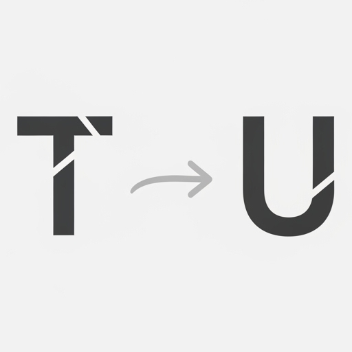

  

# URL to Title

This extension modifies the title of a web page by replacing it with, or appending, the page's URL. It works both in chrome and firefox browsers.

## How It Works

The "URL to Title" extension offers two modes for displaying page information:

1.  **Replace Title with URL**: This option replaces the current page title with its full URL.
2.  **Append URL to Title**: This option keeps the original page title and adds the full URL to the end of it.

---

## Visual Comparison

Below is a comparison showing a page title before and after the extension's effect.

  
  

---

  

